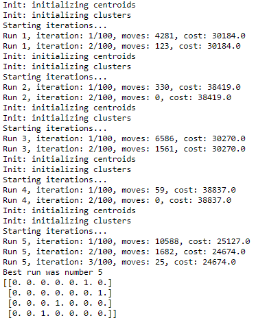
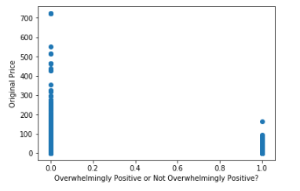
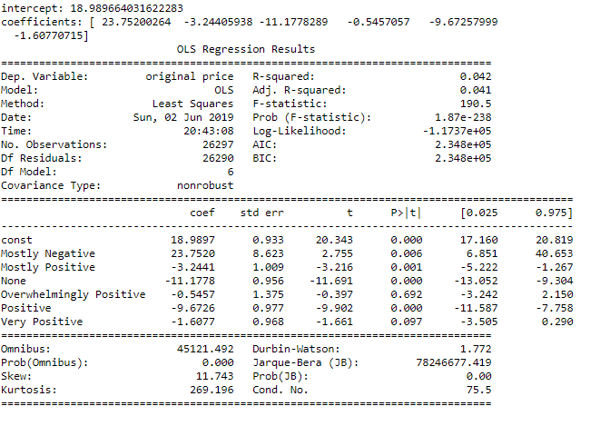

# Steam Games Clustering
This project is my first machine learning project as I start my journey into the world of data science!

#### -- Project Status: [Active]

## Project Intro/Objective
The purpose of this project is to find clusters of similar games in terms of reviews and price. I want to know which games are the most bang for my buck.

### Methods Used
* Kmodes clustering
* Linear regression
* K-modes algorithm
* Webscraping
* Data Cleaning and feature generation

### Technologies/Languages
* Python & Beautifulsoup
* HTML
* IPython & Jupyter Notebook

## Project Description
I am an avid gamer. I always wanted to know if better games cost more money to play, or if they just went on sale less often. Thus, I acquired data for over 25,000 games off the Steam website (https://store.steampowered.com/search/?) to see how many games fall under the "cheaper with bad reviews" category. 

However, due to complications and my inexperience later on into the project, I had to change course and instead ask a different question: To what extent do reviews affect the selling prices of games? This complication, as well as my entire process, will be explained down below.

## Description of my Current Process
Here's a breakdown of the steps I took and the conclusion I arrived at:

I first created a webscraper using Beautifulsoup to scrap over 25,000 games off the steam website. Fields that were scraped include title, release date, reviews, price, discount, and discounted price.

```python
def make_soup(url):
    page = urlopen(url)
    soup_data = soup(page, 'html.parser')
    return soup_data


# makes the soup out of url input
steam_soup = make_soup('https://store.steampowered.com/search/?ignore_preferences=1')

today = datetime.datetime.today()

# making the file
file_name = f'steam_sales {today:%B, %d, %Y}.txt'
f = open(file_name, 'w', encoding='utf-8')

headers = 'title, date, reviews, discount, original price, discounted price\n'

f.write(headers)

# for loop to run through any number of pages, index must start at 2
for num in range(2, 2429):
    next_page = steam_soup.find('a', attrs={'class': 'pagebtn'}).get('href')

    # replaces last element of next_page (the page number) with next page so it doesn't go back to previous page
    # regex designed to find the last number of the url, which is the page number
    next_page = next_page.replace(re.search('\d+$', next_page).group(0), str(num))

    # insert container code
    containers = steam_soup.findAll('div', {'class': 'responsive_search_name_combined'})

    # for loop to find and write all elements of every container into the csv
    for container in containers:
        title = container.div.span.text
        date = container.find('div', {'class': 'col search_released responsive_secondrow'}).text

        try:
            reviews = (container.find('div', {'class': 'col search_reviewscore responsive_secondrow'}).span[
                           'data-tooltip-html'].split('<br>'))[0]
        except Exception as e:
            reviews = ''

        discount = container.find('div', {'class': 'col search_price_discount_combined responsive_secondrow'}). \
            find('div', {'class': 'col search_discount responsive_secondrow'}).text.strip()

        try:
            original_price = container.find('div', {'class': 'col search_price_discount_combined responsive_secondrow'}). \
                find('div', {'class': 'col search_price responsive_secondrow'}).text.strip()
        except Exception as e:
            try:
                original_price = container.find('div',
                                                {'class': 'col search_price_discount_combined responsive_secondrow'}). \
                    find('div', {'class': 'col search_price discounted responsive_secondrow'}).span.strike.text
            except Exception as e:
                original_price = ''
        try:
            discounted_price = container.find('div',
                                              {'class': 'col search_price_discount_combined responsive_secondrow'}). \
                find('div', {'class': 'col search_price discounted responsive_secondrow'}).text.split('C')
            discounted_price = 'C' + discounted_price[2]
        except Exception as e:
            discounted_price = ''

        print('title', title)
        print('date', date)
        print('reviews', reviews)
        print('discount', discount)
        print('original price', original_price)
        print('discounted price', discounted_price)
        print('')

        f.write(title + '*' + date.replace(',', '') + '*' + reviews + '*' + discount + '*' + original_price + '*' +
                discounted_price + '\n')

    print(num)

    # sleep(2)
    steam_soup = make_soup(next_page)

f.close()
```

The data was then inputted into a text file and onto a Jupyter Notebook for cleaning. I had some trouble separating the different attributes into columns as the game titles tend to include most separators, such as commas. As a temporary fix, I used an asterisk as a separator to leave out as little data points as possible from my analysis.

```python
# import packages

import pandas as pd
import numpy as np
import os
import statsmodels.api as sm
import matplotlib.pyplot as plt
from kmodes.kmodes import KModes
from sklearn.linear_model import LinearRegression

# setting path

path = 'C:\Python\webscrape'
os.chdir(path) 
data = pd.read_csv('steam_sales May, 12, 2019.txt', delimiter = '*', error_bad_lines = False)
```

The initial data looked like this. 


Not too great-looking, considering there's a lot of dates missing (so that excludes age from a potential attribute), every useful variable is a string, and the discounted price has trailing characters. Here is what I did to clean the data.

```python
# converting discount to decimal and replacing NA's with 0

data['discount'] = data['discount'].str.rstrip('%').astype('float') / 100.0 *(-1)
data[['discount','discounted price']] = data[['discount','discounted price']].fillna(value = 0)

# converting 'free to play' to a price of 0 and stripping unecessary strings from original price

data = data.replace(to_replace = ['Free to Play', 'Free To Play', 'Free', 'Play for Free!', 
                                  'Free Demo', 'Free Movie', '1 Season', 'Third-party',
                                  'Play Now', 'Free Mod', 'From CDN$ 25.60', 'Install',
                                  'CDN$ 1,200.76', 'From CDN$ 25.31', 'From CDN$ 19.20'], value = np.nan)

data['original price'] = data['original price'].str.lstrip('CDN$ ').astype('float')
data['original price'] = data['original price'].fillna(value = 0)

# formatting discounted price

data = data.replace(to_replace = 'CDN$ 1,063.85							', value = np.nan)
data['discounted price'] = data['discounted price'].str.lstrip('CDN$ ').str.rstrip('\t\t\t\t\t\t\t').astype('float')
data['discounted price'] = data['discounted price'].fillna(value = data['original price'])

```

This is what it looks like afterwards.


A lot better right? Well we still have to cluster so some one-hot encoding will have to used to turn all the reviews into categorical variables.

```python
# filling in 'None' reviews and one hot encoding to handle categorical review variable

data['reviews'] = data['reviews'].fillna(value = 'None')
data = pd.concat([data ,pd.get_dummies(data['reviews'], drop_first = True)],axis=1)
data.drop(['reviews'], axis=1, inplace=True)
```

This the final product:


Now its time to finally cluster! Because I want to cluster reviews with original price to see which games belong in which category, I used the k-modes clustering method, which defines clusters based on the number of matching categories between data points. This is in contrast to the more well-known k-means algorithm, which clusters numerical data based on Euclidean distance. Because my original price variable is continuous while my review variables are cateogrical, I will have to use k-prototypes, which combines k-modes and k-means and is able to cluster mixed numerical / categorical data.

```python
# splitting original price and reviews

data_categorical = data[['original price', 'Mostly Negative', 'Mostly Positive', 'None', 
'Overwhelmingly Positive', 'Positive', 'Very Positive']]

# clustering on data

km = KModes(n_clusters=4, init='Huang', n_init=5, verbose=1)

clusters = km.fit_predict(data_categorical)
kmodes = km.cluster_centroids_

# print the cluster centroids

print(kmodes)

```


It's right here where I realized I made a mistake. All of my categorical variables were mutually exclusive, which means that I won't get any useful insights from clustering, as the clusters won't mean anything.

I had to go back the drawing board, where I redefined my question from clustering to describing, with none other than a simple linear regression! I started off by visualizing some scatterplots of reviews with respect to original price. I already knew the reviews categories were mutually exclusive so at least there wasn't any multi-collinearity to worry about!

```python
plt.scatter(data['Overwhelmingly Positive'], data['original price'])
plt.xlabel("Overwhelmingly Positive or Not Overwhelmingly Positive?")
plt.ylabel("Original Price")
```



Most scatterplots turned out this way, with a slight negative correlation with regard to original price. The regression model showed similar results.

```python
# setting up x and y variables
x = data[['Mostly Negative', 'Mostly Positive', 'None', 'Overwhelmingly Positive',
              'Positive', 'Very Positive']]
y = data['original price']
model = LinearRegression().fit(x,y)

# printing intercept and coefficients 
print('intercept:', model.intercept_)
print('coefficients:', model.coef_)

# printing statsmodel
x = sm.add_constant(x) # adding a constant
 
model = sm.OLS(y, x).fit()
predictions = model.predict(x) 
 
print_model = model.summary()
print(print_model)
```



These results were a little odd to say the least. It seems that the constant (which represented 'Mixed' reviews as well as all other unexplained factors) was positive, meaning that it is likely (because most other reviews had a negative coefficient while mostly being statistically significant) that the attribute with the smallest statistically signficant coefficient ('Very Positive' reviews) was the most likely to be the most expensive game!

An occurance I do not know how to explain is the apparent positive statistically significant coefficient of 'Mostly Negative' reviews, which could mean that the most costly games (usually triple A titles such as Call of Duty), were the most negatively received by gamers! Given my hunch that the average user on Steam is most likely to prefer cheaper Indie games, this assumption intuitively makes sense. However, given the extremely low adjusted R square, more research should be done in the future to fully flesh out this model.

## Conclusion & Next Steps

Now that I made some mistakes in defining my question according to the model I want to build, I know for next time to keep that part of my workstream as broad as possible to make sure I don't tunnel in on one specific method.

Next Steps:
* Find more data on games from Steam or otherwise (such as missing dates, number of reviews, genre, etc.)
* Categorize again with k-prototypes and intepret results
* Find a more permanent solution to some quick fixes implemented earlier on

## Contact

Feel free to email me at shawnliu30@gmail.com if you want to talk about this project or data science in general!
